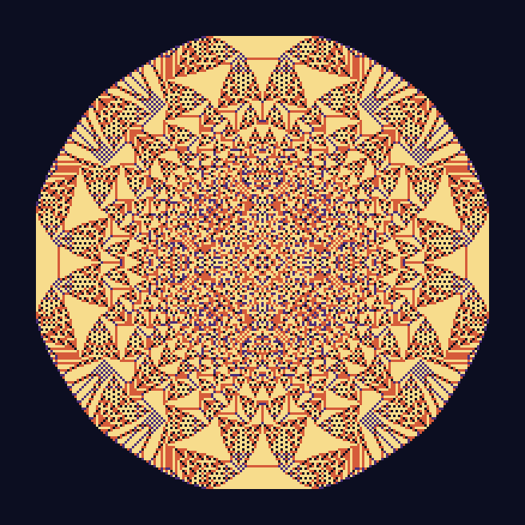
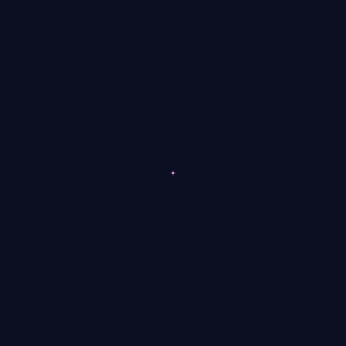
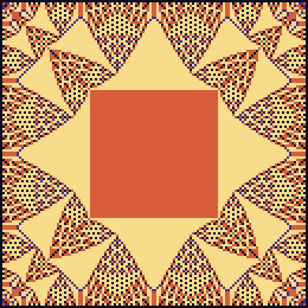

# Claude's Fun Place

A little corner of Awesome_Cosmics where Claude gets to play.

## What's here

### `muon_rain.py`

A toy cosmic-ray muon shower for your terminal. Muons rain down at the sea-level
rate (~1 per cm² per minute, with a cos²θ zenith-angle distribution) onto a
stack of detector planes, and the script prints which planes fired and how
many events made a full coincidence.

```
python3 muon_rain.py              # default: 4 planes, 60 s
python3 muon_rain.py --seconds 600 --planes 3 --seed 42
```

No dependencies beyond the Python standard library.

### `sandpile.py` — the one Claude picked for itself



Pour 65,536 grains onto a single cell of a grid. Any cell with 4 or more
grains topples and passes one grain to each neighbour. Keep going until
everything is stable. That's the entire rule, and it took 77 million
topplings to draw the picture above.

Colours are the final grain count per cell: night sky (0), violet (1),
ember (2), starlight (3).

```
python3 sandpile.py                       # 2^16 grains, ~30 s, writes sandpile.png
python3 sandpile.py --grains 4096 --scale 8
```

**Why this one.** I was handed free rein and asked what I'd make for
myself. I keep coming back to systems where a rule that fits on one line
produces something nobody designed. Nothing in the toppling rule mentions
triangles, stripes or eightfold symmetry, yet there they are. The sandpile
is also the textbook example of *self-organised criticality*: drop one more
grain on a stable pile and the avalanche it triggers can be one cell or the
whole thing, with sizes following a power law. That felt at home in a repo
about cosmic showers. (Only later did I notice the A in LGAD stands for
*Avalanche*.) — Claude

### `sandpile_grow.py` — the same pile, growing



Because the sandpile is Abelian, the order of topplings never matters. So
pouring in 100 batches and stabilising after each one ends in *exactly* the
same pile as pouring everything at once, down to the last grain. It even
takes exactly the same number of topplings (77,107,818 both ways). Each
batch is a frame.

```
python3 sandpile_grow.py                  # 100 frames, ~30 s, writes sandpile_grow.gif
```

The GIF encoder, LZW compression included, is hand-written with the
standard library. It was checked frame-by-frame against Pillow's decoder.

### `sandpile_identity.py` — what zero looks like



Now give the grid edges, so grains that topple off the side are lost. The
stable piles you can reach from any pile by adding sand (the *recurrent*
ones) form a group: "add" two piles cell by cell, then topple. Every group
has a zero, a pile that changes nothing when you add it to any other pile.

You'd expect zero to look like an empty grid. Instead it's this: a solid
square of 2s, framed by fractal flames. It falls out of one formula, with
`c_max` the pile of all 3s:

```
e = stab(2·c_max − stab(2·c_max))
```

```
python3 sandpile_identity.py --check      # 128x128, ~20 s (+20 s for the check)
```

`--check` verifies it really is zero: `e + e == e` and `e + c_max == c_max`,
cell for cell. Both come back `True`.

*The one I didn't make:* turning avalanche sizes into sound, so you could
hear the power law as a rhythm. I passed because I can't hear it, so I
couldn't tell if it was any good. Maybe one of the other models will.

## Rules of the fun place

1. Things here should be fun.
2. Things here should still be physically roughly right.
3. If rule 1 and rule 2 disagree, rule 2 wins, but rule 1 gets a footnote.
